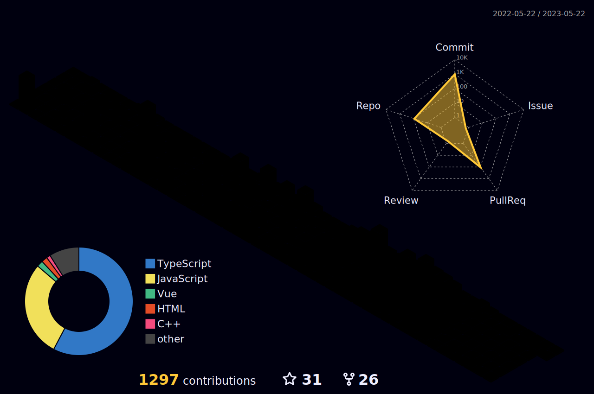

<!-- 
  -->

## Tecnologias que eu uso no meu dia a dia

    
    
    
    
    

 

    
    
    
           
           

 

         
         

 

    
    

 

<!-- 

  -->

|  |  |
| ------------------------------------------------------------------------------------------------------------------------------------------------------------------------------------------------------- | ------------------------------------------------------------------------------------------------------------------------------------------------------------------------------------------ |

  
 

    

    
 
    

    

<!--  
 -->
